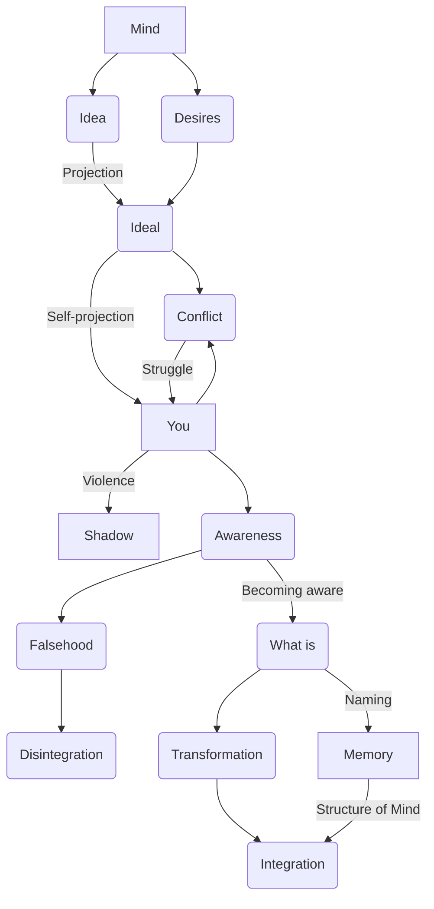

February 2
All becoming is disintegration

Create a Mermaid Concept Map Diagram in text format identifying key concepts and keeping their names short  and name their relationships from this corresponding underlying text below from Jiddu Krishnamurti,  do not provide explanations or any further list or notes, only provide this Mermaid Concept Map Diagram in text format.

The mind has an idea, perhaps pleasurable, and it wants to be like that idea, which is a projection of your desire. You are this, which you do not like, and you want to become that, which you like. The ideal is a self-projection; the opposite is an extension of what is; it is not the opposite at all, but a continuity of what is, perhaps somewhat modified. The projection is self-willed, and conflict is the struggle towards the projection....You are struggling to become something, and that something is part of yourself. The ideal is your own projection. See how the mind has played a trick upon itself. You are struggling after words, pursuing your own projection, your own shadow. You are violent, and you are struggling to become nonviolent, the ideal; but the ideal is a projection of what is, only under a different name.
When you are aware of this trick which you have played upon yourself, then the false as the false is seen. The struggle towards an illusion is the disintegrating factor. All conflict, all becoming is disintegration. When there is an awareness of this trick that the mind has played upon itself, then there is only what is. When the mind is stripped of all becoming, of all ideals, of all comparison and condemnation, when its own structure has collapsed, then the what is has undergone complete transformation. As long as there is the naming of what is, there is relationship between the mind and what is; but when this naming process—which is memory, the very structure of the mind—is not, then what is is not. In this transformation alone is there integration.

