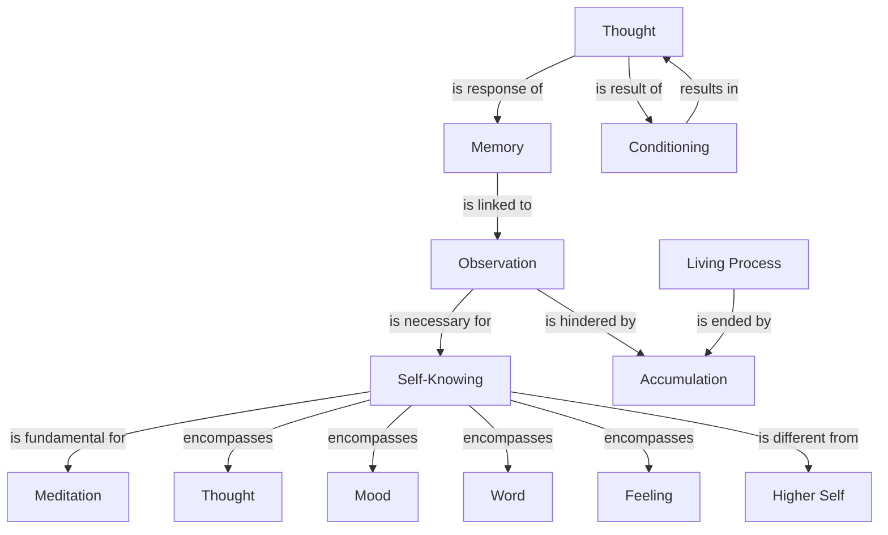

January 28
 Self-knowing

Without knowing yourself, do what you will, there cannot possibly be the state of meditation. I mean by “self-knowing,” knowing every thought, every mood, every word, every feeling; knowing the activity of your mind—not knowing the Supreme Self, the big Self; there is no such thing; the Higher Self, the Atman, is still within the field of thought. Thought is the result of your conditioning, thought is the response of your memory— ancestral or immediate. And merely to try to meditate without first establishing deeply, irrevocably, that virtue which comes about through self-knowing, is utterly deceptive and absolutely useless.
Please, it is very important for those who are serious, to understand this. Because if you cannot do that, your meditation and actual living are divorced, are apart—so wide apart that though you may meditate, taking postures indefinitely, for the rest of your life, you will not see beyond your nose; any posture you take, anything that you do, will have no meaning whatsoever.
...It is important to understand what this self-knowing is, just to be aware, without any choice, of the “me” which has its source in a bundle of memories—just to be conscious of it without interpretation, merely to observe the movement of the mind. But that observation is prevented when you are merely accumulating through observation—what to do, what not to do, what to achieve, what not to achieve; if you do that, you put an end to the living process of the movement of the mind as the self. That is, I have to observe and see the fact, the actual, the what is. If I approach it with an idea, with an opinion — such as “I must not,” or “I must,” which are the responses of memory—then the movement of what is is hindered, is blocked; and therefore, there is no learning.

