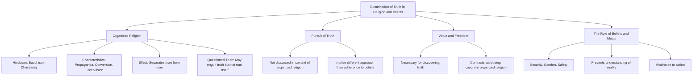

Prompt: 
Create a Mermaid diagram in text format, identifying key concepts breaking down these concepts  and their interrelations from the given text based on Jiddu Krishnamurti talks:

The question is: Is there not truth in religions, in theories, in ideals, in beliefs? Let us examine. What do we mean by religion? Surely, not organized religion, not Hinduism, Buddhism, or Christianity—which are all organized beliefs with their propaganda, conversion, proselytism, compulsion, and so on. Is there any truth in organized religion? It may engulf, enmesh truth, but the organized religion itself is not true.
 Therefore, organized religion is false, it separates man from man. You are a Muslim, I am a Hindu, another is a Christian or a Buddhist—and we are wrangling, butchering each other. Is there any truth in that? We are not discussing religion as the pursuit of truth, but we are considering if there is any truth in organized religion. We are so conditioned by organized religion to think there is truth in it that we have come to believe that by calling oneself a Hindu, one is somebody, or one will find God.
 How absurd, sir; to find God, to find reality, there must be virtue. Virtue is freedom, and only through freedom can truth be discovered—not when you are caught in the hands of organized religion, with its beliefs. And is there any truth in theories, in ideals, in beliefs? Why do you have beliefs? Obviously, because beliefs give you security, comfort, safety, a guide. In yourself you are frightened, you want to be protected, you want to lean on somebody, and therefore you create the ideal, which prevents you from understanding that which is. Therefore, an ideal becomes a hindrance to action.

To create a Mermaid diagram in text format based on the given text from Jiddu Krishnamurti's talks, we will identify key concepts and their interrelations. Here's how the diagram can be structured:

1. Main Topic: Examination of Truth in Religion and Beliefs
   
2. Sub-Topics:
   - Organized Religion
   - Pursuit of Truth
   - Virtue and Freedom
   - The Role of Beliefs and Ideals

3. Interrelations:
   - Organized Religion
     - Includes Hinduism, Buddhism, Christianity
     - Characteristics: Propaganda, Conversion, Compulsion
     - Effect: Separates man from man
     - Questioned Truth: Organized religion may engulf truth but is not true itself
   
   - Pursuit of Truth
     - Not discussed in the context of organized religion
     - Implies a different approach than adherence to organized beliefs

   - Virtue and Freedom
     - Necessary for discovering truth
     - Contrasted with being caught in organized religion

   - The Role of Beliefs and Ideals
     - Serve as security, comfort, and safety
     - Prevent understanding of reality
     - Act as a hindrance to action

4. Overall Conclusion:
   - Questioning the truth in organized religions, theories, ideals, and beliefs
   - Emphasizing the need for virtue and freedom to discover truth

Here's how this structure can be represented in a Mermaid diagram format:

This diagram visually represents the key concepts and their interrelationships as discussed in the text.