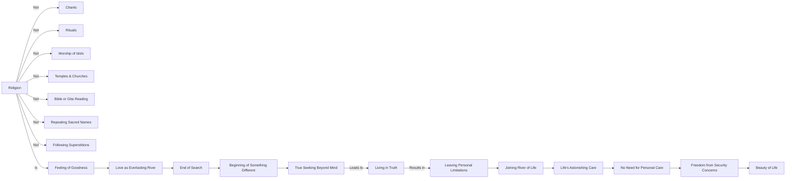

Create a Mermaid diagram in text format, identifying key concepts, keep their names short,  breaking down these concepts  and their interrelations from the given text based on Jiddu Krishnamurti talks:

Do you know what religion is? It is not the chant, it is not in the performance of puja, or any other ritual, it is not in the worship of tin gods or stone images, it is not in the temples and churches, it is not in the reading of the Bible or the Gita, it is not in the repeating of a sacred name or in the following of some other superstition invented by men.
 None of this is religion.
 Religion is the feeling of goodness that love which is like the river living moving everlastingly. In that state you will find there comes a moment when there is no longer any search at all; and this ending of search is the beginning of something totally different. The search for God, for truth, the feeling of being completely good—not the cultivation of goodness, of humility, but the seeking out of something beyond the inventions and tricks of the mind, which means having a feeling for that something, living in it, being it—that is true religion. But you can do that only when you leave the pool you have dug for yourself and go out into the river of life.
 Then life has an astonishing way of taking care of you, because then there is no taking care on your part. Life carries you where it will because you are part of itself; then there is no problem of security, of what people say or don’t say, and that is the beauty of life.

To create a Mermaid diagram in text format from the given text, we'll first identify the key concepts and their interrelations as presented in Jiddu Krishnamurti's talk. The diagram will break down these concepts, keeping their names short and illustrating how they connect to each other.

Here's a conceptual breakdown in Mermaid diagram format:

This diagram illustrates the key concepts from Krishnamurti's talk, showing what religion is not (such as chants, rituals, idol worship, and reading sacred texts) and what it is (feeling of goodness, love as an everlasting river, ending of search leading to something different, true seeking beyond mind, living in truth, and joining the river of life, which leads to life's astonishing care and the beauty of life).