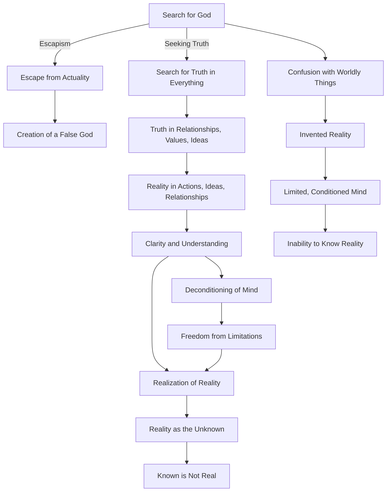

Create a Mermaid diagram in text format, identifying key concepts, keep their names short,  breaking down these concepts  and their interrelations from the given text based on Jiddu Krishnamurti talks:

What is the impetus behind the search for God, and is that search real? For most of us, it is an escape from actuality. So, we must be very clear in ourselves whether this search after God is an escape, or whether it is a search for truth in everything—truth in our relationships, truth in the value of things, truth in ideas. If we are seeking God merely because we are tired of this world and its miseries, then it is an escape. Then we create God, and therefore it is not God. The God of the temples, of thebooks, is not God, obviously—it is a marvelous escape. But if we try to find the truth, not in one exclusive set of actions, but in all our actions, ideas and relationships, if we seek the right evaluation of food, clothing, and shelter, then because our minds are capable of clarity and understanding, when we seek reality we shall find it. It will not then be an escape. But if we are confused with regard to the things of the world— food, clothing, shelter, relationship, and ideas—how can we find reality? We can only invent reality. So, God, truth, or reality, is not to be known by a mind that is confused, conditioned, limited. How can such a mind think of reality or God? It has first to decondition itself. It has to free itself from its own limitations, and only then can it know what God is, obviously not before. Reality is the unknown, and that which is known is not the real.

Based on Jiddu Krishnamurti's talk, here's a Mermaid diagram in text format that breaks down the key concepts and their interrelations:

This diagram illustrates the two paths in the search for God as described by Krishnamurti: one as an escape from reality, leading to the creation of a false god, and the other as a genuine quest for truth in all aspects of life. The latter path requires clarity and understanding, deconditioning of the mind, and recognizing the limitations of the known to realize the true nature of reality or God.
