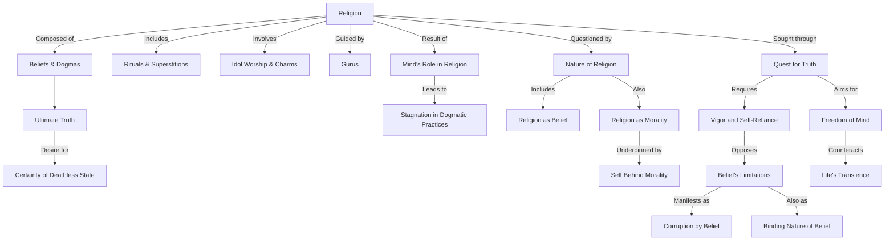

To create a Mermaid diagram in text format for the given text, we'll first break down the key concepts and their interrelations. Here's a structured breakdown:

1. Religion: Defined as a composite of beliefs, rituals, superstitions, and idol worship.
   - Beliefs & Dogmas: Accepted truths without questioning.
   - Rituals & Superstitions: Traditional practices and beliefs in supernatural influences.
   - Idol Worship & Charms: Physical representation of divine and mystical objects for worship.
   - Gurus: Spiritual guides leading followers towards their goals.

2. Ultimate Truth: The personal projection of one’s desires and paths to happiness.
   - Projection of Desires: Individual’s aspiration for happiness and fulfillment.
   - Certainty of Deathless State: The quest for understanding or overcoming mortality.

3. Mind’s Role in Religion: The mind’s involvement in creating and sustaining religious beliefs.
   - Creation of Dogmatic Religion: Formulating beliefs and practices without question.
   - Stagnation in Dogmatic Practices: Lack of progress or questioning in established religious norms.

4. Nature of Religion:
   - Religion as Belief: Acceptance of others' experiences and assertions without personal insight.
   - Religion as Morality: Following ethical codes and societal norms.
   - Self Behind Morality: The underlying personal ego and desires behind moral actions.

5. Quest for Truth:
   - Finding Truth Without Belief: Seeking understanding beyond traditional beliefs.
   - Vigor and Self-Reliance: Personal strength and independence in the pursuit of truth.
   - Freedom of Mind: Achieving mental liberation through self-reliance and vigor.

6. Life’s Transience: Recognition of life’s impermanence and the inevitability of death.

7. Belief’s Limitations:
   - Corruption by Belief: The negative impact of rigid beliefs.
   - Binding Nature of Belief: Restrictions imposed by unexamined beliefs.

Now, let's convert this into a Mermaid diagram text format:

This diagram visually represents the relationships between the key concepts identified in the text.