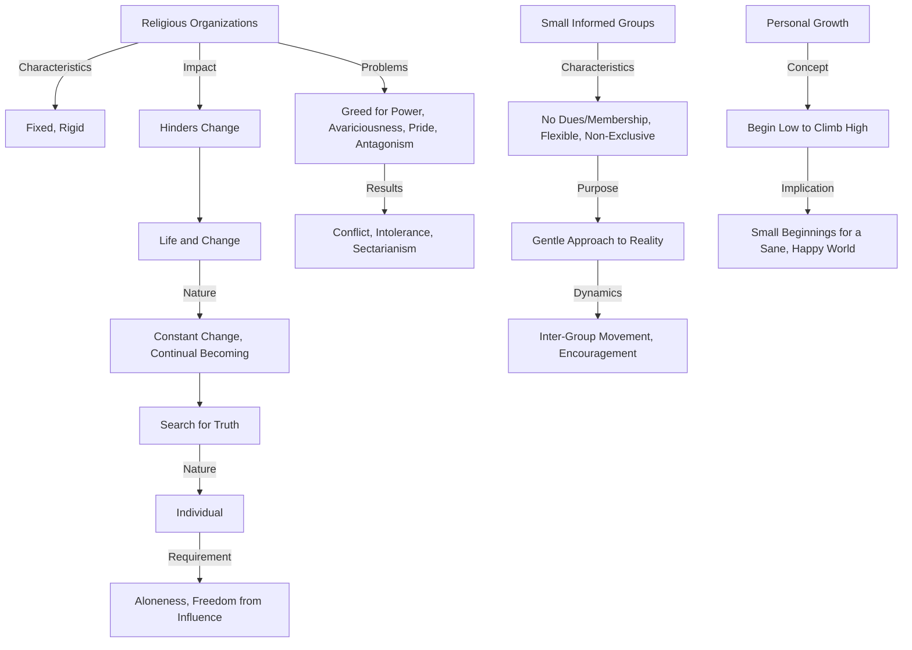

Prompt: 
Create a Mermaid diagram in text format, identifying key concepts, keep their names short, breaking down it and their interrelations from the given text based on Jiddu Krishnamurti talks:

Religious organizations become as fixed and as rigid as the thoughts of those who belong to them. Life is a constant change, a continual becoming, a ceaseless revolution, and because an organization can never be pliable, it stands in the way of change; it becomes reactionary to protect itself. The search for truth is individual, not congregational. To commune with the real there must be aloneness, not isolation but freedom from all influence and opinion. Organizations of thought inevitably become hindrances to thought.
 As you yourself are aware, the greed for power is almost inexhaustible in a so-called spiritual organization; this greed is covered over by all kinds of sweet and official-sounding words, but the canker of avariciousness, pride and antagonism is nourished and shared. From this grow conflict, intolerance, sectarianism and other ugly manifestations.
 Would it not be wiser to have small informed groups of twenty or twenty- five persons, without dues or membership, meeting where it is convenient to discuss gently the approach to reality? To prevent any group from becoming exclusive, each member could from time to time encourage and perhaps join another small group; thus it would be extensive, not narrow and parochial.
 To climb high one must begin low. Out of this small beginning one may help to create a more sane and happy world.

Based on the key concepts from the text derived from Jiddu Krishnamurti's talks, here is a Mermaid diagram in text format:

This diagram outlines the relationship between religious organizations, their inherent rigidity, and the impact on individual thought and the search for truth. It also suggests an alternative in the form of small, flexible groups to foster a more open and progressive approach to spirituality and truth-seeking.