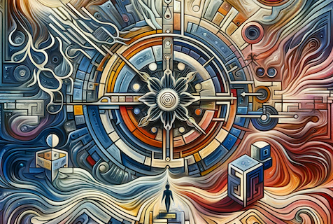

January 21
Authority corrupts both leader and follower

Self-awareness is arduous, and since most of us prefer an easy, illusory way, we bring into being the authority that gives shape and pattern to our life. This authority may be the collective, the State; or it may be the personal, the Master, the savior, the guru. Authority of any kind is blinding, it breeds thoughtlessness; and as most of us find that to be thoughtful is to have pain, we give ourselves over to authority. Authority engenders power, and power always becomes centralized and therefore utterly corrupting; it corrupts not only the wielder of power, but also him who follows it. The authority of knowledge and experience is perverting, whether it be vested in the Master, his representative or the priest. It is your own life, this seemingly endless conflict, that is significant, and not the pattern or the leader. The authority of the Master and the priest takes you away from the central issue, which is the conflict within yourself.

