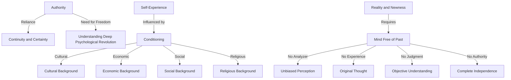

January 22
Can I rely on my experience?

Most of us are satisfied with authority because it gives us a continuity, a certainty, a sense of being protected. But a man who would understand the implications of this deep psychological revolution must be free of authority, must he not? He cannot look to any authority, whether of his own creation or imposed upon him by another. And is this possible? Is it possible for me not to rely on the authority of my own experience? Even when I have rejected all the outward expressions of authority—books, teachers, priests, churches, beliefs—I still have the feeling that at least I can rely on my own judgment, on my own experiences, on my own analysis. But can I rely on my experience, on my judgment, on my analysis? My experience is the result of my conditioning, just as yours is the result of your conditioning, is it not? I may have been brought up as a Muslim or a Buddhist or a Hindu, and my experience will depend on my cultural, economic, social, and religious background, just as yours will. And can I rely on that? Can I rely for guidance, for hope, for the vision which will give me faith in my own judgment, which again is the result of accumulated memories, experiences, the conditioning of the past meeting the present?...Now, when I have put all these questions to myself and I am aware of this problem, I see there can only be one state in which reality, newness, can come into being, which brings about a revolution. That state is when the mind is completely empty of the past, when there is no analyzer, no experience, no judgment, no authority of any kind.

