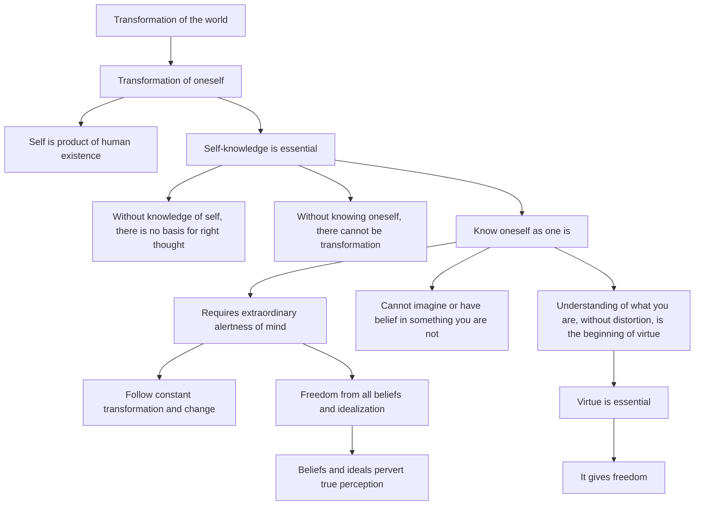

January 24
The untethered mind

The transformation of the world is brought about by the transformation of oneself, because the self is the product and a part of the total process of human existence. To transform oneself, self-knowledge is essential; without knowing what you are, there is no basis for right thought, and without knowing yourself there cannot be transformation. One must know oneself as one is, not as one wishes to be, which is merely an ideal and therefore fictitious, unreal; it is only that which is that can be transformed, not that whichyou wish to be. To know oneself as one is requires an extraordinary alertness of mind, because what is is constantly undergoing transformation, change; and to follow it swiftly the mind must not be tethered to any particular dogma or belief, to any particular pattern of action. If you would follow anything, it is no good being tethered. To know yourself, there must be the awareness, the alertness of mind in which there is freedom from all beliefs, from all idealization, because beliefs and ideals only give you a color, perverting true perception. If you want to know what you are, you cannot imagine or have belief in something which you are not. If I am greedy, envious, violent, merely having an ideal of nonviolence, of non-greed, is of little value....The understanding of what you are, whatever it be—ugly or beautiful, wicked or mischievous—the understanding of what you are, without distortion, is the beginning of virtue. Virtue is essential, for it gives freedom.

