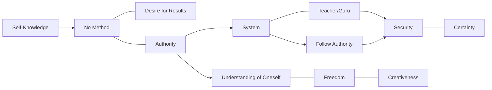

January 26
Creativeness through self-knowledge

...There is no method for self-knowledge. Seeking a method invariably implies the desire to attain some result and that is what we all want. We follow authority—if not that of a person, then of a system, of an ideology because we want a result that will be satisfactory, which will give us security. We really do not want to understand ourselves, our impulses and reactions, the whole process of our thinking, the conscious as well as the unconscious; we would rather pursue a system which assures us of a result. But the pursuit of a system is invariably the outcome of our desire for secur ity, for certainty, and the result is obviously not the understanding of oneself. When we follow a method, we must have authorities—the teacher, the guru, the savior, the Master—who will guarantee us what we desire; and surely that is not the way to self-knowledge.
Authority prevents the understanding of oneself, does it not? Under the shelter of an authority, a guide, you may have temporarily a sense of security, a sense of wellbeing, but that is not the understanding of the total process of oneself. Authority in its very nature prevents the full awareness of oneself and therefore ultimately destroys freedom; in freedom alone can there be creativeness. There can be creativeness only through self- knowledge.

