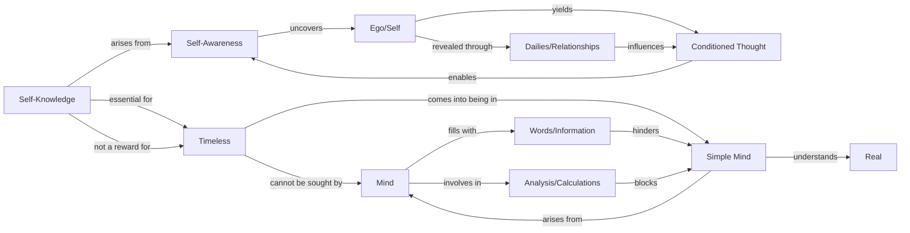

January 27
Quiet mind, simple mind

When we are aware of ourselves, is not the whole movement of living a way of uncovering the “me,” the ego, the self? The self is a very complex process which can be uncovered only in relationship, in our daily activities, in the way we talk, the way we judge, calculate, the way we condemn others and ourselves. All that reveals the conditioned state of our own thinking, and is it not important to be aware of this whole process? It is only through awareness of what is true from moment to moment that there is discovery of the timeless, the eternal. Without self-knowledge, the eternal cannot be. When we do not know ourselves, the eternal becomes a mere word, a symbol, a speculation, a dogma, a belief, an illusion to which the mind can escape. But if one begins to understand the “me” in all its various activities from day to day, then in that very understanding, without any effort, the nameless, the timeless comes into being. But the timeless is not a reward for self-knowledge. That which is eternal cannot be sought after; the mind cannot acquire it. It comes into being when the mind is quiet, and the mind can be quiet only when it is simple, when it is no longer storing up, condemning, judging, weighing. It is only the simple mind that can understand the real, not the mind that is full of words, knowledge, information. The mind that analyzes, calculates, is not a simple mind.

