January 30 
Self-knowledge

Right thinking comes with self-knowledge. Without understanding yourself, you have no basis for thought; without self-knowledge what you think is not true.
You and the world are not two different entities with separate problems; you and the world are one. Your problem is the world’s problem. You may be the result of certain tendencies, of environmental influences, but you are not different fundamentally from another. Inwardly we are very much alike; we are all driven by greed, ill will, fear, ambition, and so on. Our beliefs, hopes, aspirations have a common basis. We are one; we are one humanity, though the artificial frontiers of economics and politics and prejudice divide us. If you kill another, you are destroying yourself. You are the center of the whole, and without understanding yourself you cannot understand reality.
We have an intellectual knowledge of this unity but we keep knowledge and feeling in different compartments and hence we never experience the extraordinary unity of man.

```mermaid
graph TB
  SelfKnowledge[Self-Knowledge] -->|comes with| RightThinking[Right Thinking]
  UnderstandingSelf[Understanding Yourself] -->|basis for| Thought[Thought]
  SelfKnowledge-->|requirement for| TrueThought[True Thought]
  You[You] -->|not separate from| World[World]
  You-->|result of| Tendencies[Tendencies] 
  You-->|result of| Environment[Environmental Influences] 
  You-->|not fundamentally different from| Others[Others]
  InnerDrive[Inner Drive] -->|shared by| Humanity[Humanity]
  Beliefs[Beliefs]-->|have common basis in| HumanUnity[One Humanity]
  ArtificialFrontiers[Artificial Frontiers]-->|divide| HumanUnity
  Killing[Killing another]-->|equals| SelfDestruction[Self-Destruction]
  You -->|center of| Whole[Whole]
  UnderstandingSelf -->|requirement for| UnderstandingReality[Understanding Reality]
  IntellectualKnowledge[Intellectual Knowledge of Unity] -->|separated from feeling| NoExperience[No Experience of Unity] 
```

