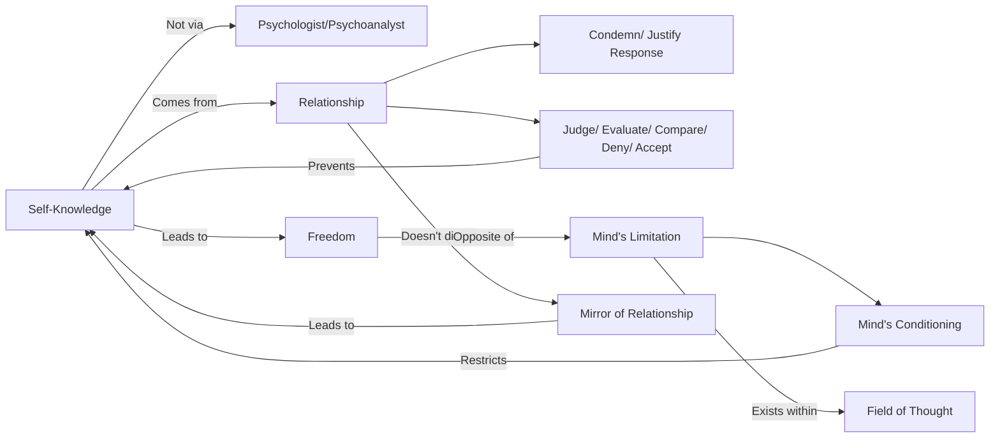

January 31
Relationship is a mirror

Self-knowledge is not according to any formula. You may go to a psychologist or a psychoanalyst to find out about yourself, but that is not self-knowledge. Self-knowledge, comes into being when we are aware, of ourselves in relationship, which shows what we are from moment to moment. Relationship is a mirror in which to see ourselves as we actually are. But most of us are incapable of looking at ourselves as we are in relationship, because we immediately begin to condemn or justify what we see. We judge, we evaluate, we compare, we deny or accept, but we never observe actually what is, and for most people this seems to be the most difficult thing to do; yet this alone is the beginning of self-knowledge. If one is able to see oneself as one is in this extraordinary mirror of relationship which does not distort, if one can just look into this mirror with full attention and see actually what is, be aware of it without condemnation, without judgment, without evaluation—and one does this when there is earnest interest—then onewill find that the mind is capable of freeing itself from all conditioning; and it is only then that the mind is free to discover that which lies beyond the field of thought.
After all, however learned or however petty the mind may be, it is consciously or unconsciously limited, conditioned, and any extension of this conditioning is still within the field of thought. So freedom is something entirely different.

